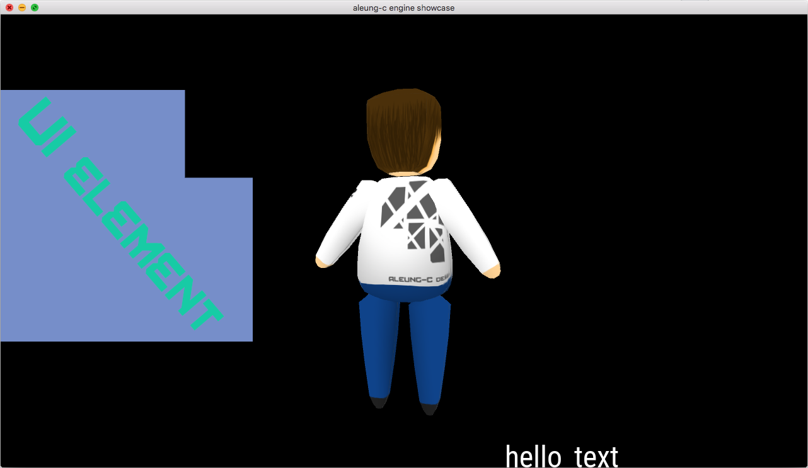

# aleung-c_engine_ShowCase
A simple scene and minimum code for the aleung-c_engine.

----

This is an example of using the [aleung-c_engine](https://github.com/aleung-c/aleung-c_engine).

It is easier to understand the value of the code engine overlay with this ShowCase,
as the [main.cpp](https://github.com/aleung-c/aleung-c_engine_ShowCase/blob/master/src/main.cpp) file says it all.

If your engine is linked correctly, the engine allows you to display models, pictures and text in just some lines.
You are then free to organize your gameplay code and logic as you like.

For a full games and app made with the engine, see [42Run](https://github.com/aleung-c/42run) and [ParticleSystem](https://github.com/aleung-c/ParticleSystem).
